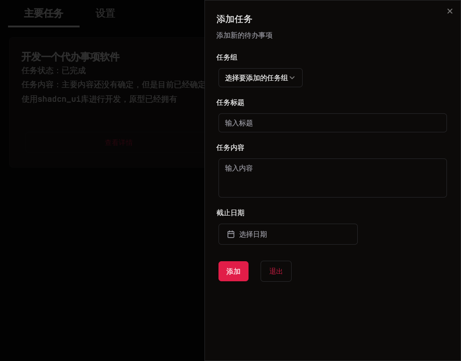

# FTodoList


[简体中文](README_ZH.md)

A minimalist Todo software, just for fun, but I will continue to maintain this project.




## Getting Started

```bash
git clone https://github.com/lubette/FTodoList.git
cd FTodoList
flutter pub get

# For Linux
./build_in_linux.sh

# For Windows
./build_in_windows.bat
```
### Prerequisites

Flutter, Dart environment

List:
  - **List 1**: Some description
  - **List 2**: Some description

## Usage

Instructions on how to use the project or its features.

## Contribution Guide

Instructions on how to contribute to the project.

## License

This project is licensed under the [MIT] license - see the [LICENSE](LICENSE) file for details.

## Acknowledgements

Thanks to those who contributed to the project or provided inspiration.
