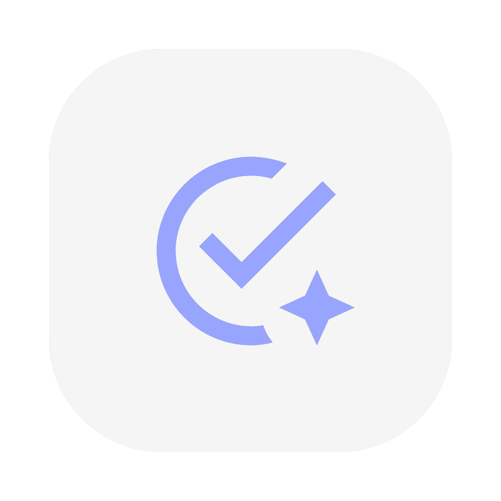

# 欢迎来到 Aim 👋

<div align="center">

</div>


[](#)

这是一款使用 Flutter 开发并基于 Shadcn 库的TodoList应用程序。我正在逐步对其进行更新，以使其能够应对各种场景。

## 用法

```sh
git clone https://github.com/Lubette/Aim
cd Aim
flutter pub get


# 适用于 Linux
./build_in_linux.sh
# 适用于 Android
./build_in_android.sh
# 适用于 Windows
./build_in_windows.bat
```

运行测试

```bash
flutter test
```


## 作者

👤 **Jinhong Zeng**

* 网站：https://lubette.github.io/
* Github：[@lubette](https://github.com/Lubette)

## 表示支持

如果这个项目帮到您，请点个Star！